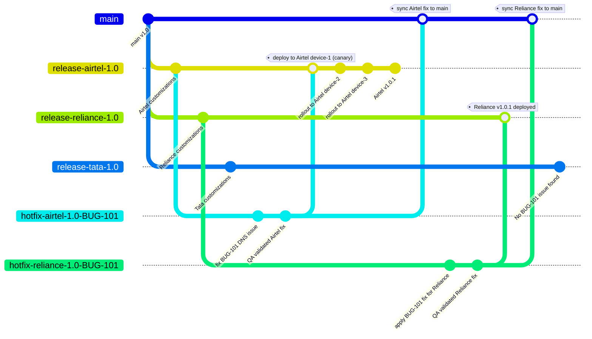

# Hotfix Lifecycle – Bitloka DDI Manager

## Overview

The Bitloka DDI Manager supports multiple customers such as Airtel, Reliance, and Tata.  
Each customer maintains its own release branch because deployments, configurations, and customizations differ.

Examples:
- `release/Airtel/1.0` → Airtel
- `release/Reliance/1.0` → Reliance
- `release/Tata/1.0` → Tata

When a production issue is reported, a dedicated hotfix branch is created from the affected customer release branch.

Example:
If Airtel reports a DNS issue in `release/Airtel/1.0`, a hotfix branch like:

```bash
hotfix/Airtel/1.0-BUG-101
```

is created.

The developer fixes the issue in GitHub, QA validates it, and the fix is first deployed to one Airtel device using a canary deployment approach before rolling out to all devices.

After successful deployment:
- The hotfix is merged back into the customer release branch
- The fix is synced to `main` so future releases include it
- Other customer branches are checked separately
- Fixes are applied only where the issue exists
- The hotfix branch is closed/deleted after deployment

---

# Hotfix Lifecycle

```text
Create → Fix → QA → Canary → Rollout → Merge → Sync to Main → Close
```

---

# GitGraph – Customer Specific Hotfix Workflow



## Git Commands Used in Hotfix Lifecycle

### 1. Repository Sync

Used to get the latest product code before starting any workflow.

```bash id="cp2ry0"
git checkout main
git pull origin main
```

* `checkout` → switches to the main branch
* `pull` → gets latest commits from remote repository

---

### 2. Release Branch Creation

Used when creating a stable customer-specific production branch.

```bash id="lck9vp"
git checkout -b release-airtel-1.0
git push -u origin release-airtel-1.0
```

* `checkout -b` → creates and switches to new branch
* `push -u` → pushes branch to GitHub and links upstream

Used for:

* Airtel release
* Reliance release
* Tata release

---

### 3. Hotfix Branch Creation

Used to isolate a production fix from the customer release branch.

```bash id="ocjlwm"
git checkout release-airtel-1.0
git checkout -b hotfix-airtel-1.0-BUG-101
```

* First command selects affected release branch
* Second command creates dedicated hotfix branch

Used when:

* Production issue is reported

---

### 4. Development Commands

Used by developers to save the fix.

```bash id="njlwm6"
git add .
git commit -m "fix BUG-101 DNS issue"
git push
```

* `add` → stages modified files
* `commit` → creates fix snapshot/history
* `push` → uploads commits to GitHub

Used during:

* Code fix implementation

---

### 5. QA Validation Support

Used to inspect changes before deployment.

```bash id="ajjlwm"
git log
git diff
```

* `log` → shows commit history
* `diff` → shows code changes

Used by:

* QA / reviewers / developers

---

### 6. Merge into Release Branch

Used after QA approval to move fix into production release branch.

```bash id="gtjlwm"
git checkout release-airtel-1.0
git merge hotfix-airtel-1.0-BUG-101
```

* `merge` → combines hotfix commits into release branch

Used before:

* Production deployment

---

### 7. Sync Fix to Main

Used so future product versions also contain the production fix.

```bash id="jlwm4q"
git checkout main
git cherry-pick <commit-id>
```

* `cherry-pick` → copies only required fix commit into main

Preferred because:

* Avoids customer-specific changes entering main

---

### 8. Release Tagging

Used to mark production release versions.

```bash id="jlwm1m"
git tag art-v1.0.1
git push origin --tags
```

Used for:

* Version tracking
* Deployment traceability

---

### 9. Cleanup

Used after deployment and synchronization are completed.

```bash id="jlwm8s"
git branch -d hotfix-airtel-1.0-BUG-101
git push origin --delete hotfix-airtel-1.0-BUG-101
```

* Deletes temporary hotfix branch locally and remotely

Used when:

* Hotfix lifecycle is complete

---

## Overall Workflow Sequence

```text id="jlwm9x"
Repository Sync
→ Release Branch
→ Hotfix Branch
→ Development
→ QA Validation
→ Merge to Release
→ Deployment
→ Sync to Main
→ Cleanup
```


