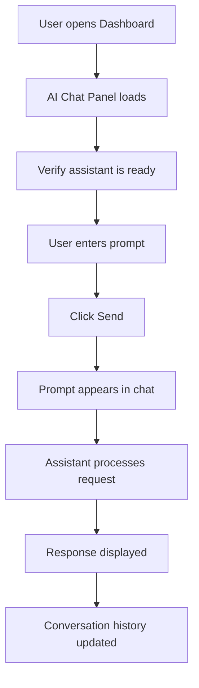

# AI Chat Panel Test Design

## Feature
AI Chat Panel

## Purpose
Verify that the AI Chat Panel accepts user prompts, displays responses, and behaves correctly under different scenarios.

---

# UI Components

| Component | Type | Description |
|-----------|------|-------------|
| Chat Header | Label | Displays "AI Agent" |
| Context Label | Label | Current page context (e.g., CampusTrack / Dashboard) |
| Conversation Area | Panel | Displays chat history |
| Prompt Input | Text Area | User enters prompt |
| Send Button | Button | Sends the prompt |
| Assistant Response | Message | AI-generated response |

---

# Flow

---

# Preconditions

- User is logged in.
- Dashboard page is open.
- AI Chat Panel is visible.
- Send button is enabled.

---

# Test Scenarios

## Scenario 1 - Initial Load

Objective

Verify AI Chat Panel loads correctly.

Expected

- AI Agent title visible
- Current page context displayed
- Welcome message displayed
- Prompt input enabled
- Send button enabled

---

## Scenario 2 - Send Valid Prompt

Prompt

help

Expected

- User message displayed
- AI response displayed
- Response belongs to latest prompt

---

## Scenario 3 - Empty Prompt

Prompt

(empty)

Expected

- Request is not sent
- Validation message shown OR Send disabled

---

## Scenario 4 - Multiple Messages

Prompt Sequence

help
show dashboard
show fee collection

Expected

- All prompts preserved
- Responses displayed in order

---

## Scenario 5 - Long Prompt

Verify long prompts are accepted.

Expected

- Input not truncated
- Response received

---

## Scenario 6 - Error Handling

Simulate AI timeout or failure.

Expected

- Error message displayed
- Input remains enabled
- User can retry

---

# Reusable Robot Keywords

Open Dashboard

Verify Chat Panel Loaded

Enter Prompt

Click Send

Verify User Message

Verify Assistant Response

Verify Welcome Message

Verify Chat History

Verify Error Message

---

# Assertions

Chat header exists

Prompt textbox enabled

Send button enabled

User message visible

Assistant response visible

---

# Test Data

help

show quick links

show fee collection

what is selected

open notifications

---

# AI Generation Instructions

Generate Robot Framework tests using Browser Library.

Reuse existing keywords whenever possible.

Create reusable keywords for chat interactions.

Use explicit waits instead of sleeps.

Capture screenshot on failure.

Keep one Robot test per scenario.

Do not duplicate keyword implementations.
