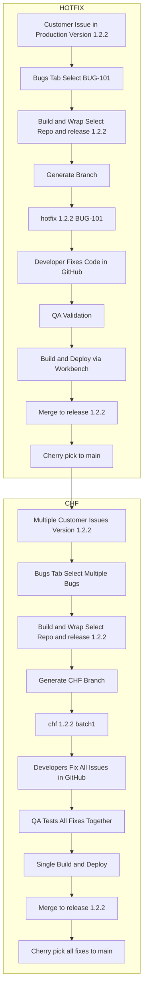
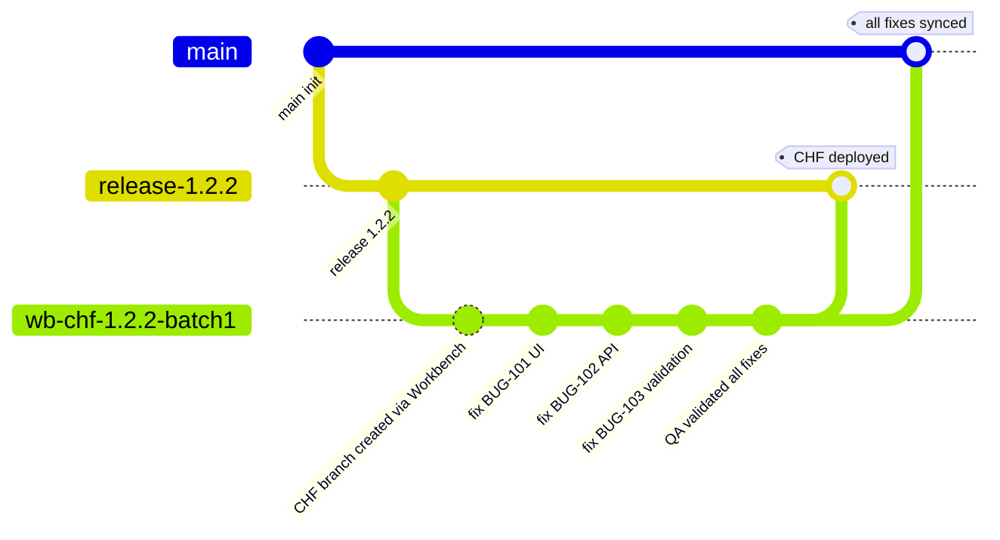

## Hotfix Lifecycle & Consolidated Hotfix Git Flow

In real-world scenarios, different customers may use different versions of the product, so multiple release branches are maintained, such as release/1.2.2. Each customer is mapped to a specific release branch rather than the main development branch.

A hotfix is a quick fix applied to resolve critical issues in a specific production version. When an issue is identified in version 1.2.2 (for example, a customer facing a bug in release/1.2.2), a hotfix branch is created from the corresponding release branch, not from the main branch. The fix is implemented, tested by QA, and deployed to the affected customer.

After deployment, the fix is cherry-picked into the main branch to ensure future releases include the change.

A consolidated hotfix (CHF) refers to grouping multiple fixes together and deploying them in a single release to reduce deployment effort and improve efficiency.

Customers currently face challenges such as managing multiple branches, identifying the correct version for fixes, ensuring proper testing, and maintaining coordination between QA, frontend, and backend teams.

The application solves this by providing a structured workflow to select the correct issue, map it to the appropriate branch, manage fixes, and track deployment with full traceability.

It also ensures that all teams are aligned on the same workflow, reducing miscommunication and improving reliability of hotfix delivery.

Overall, this approach simplifies hotfix management and ensures faster, controlled, and error-free production fixes.

---

## Hotfix vs Consolidated Hotfix Flow

---

## Consolidated Hotfix Git Flow

